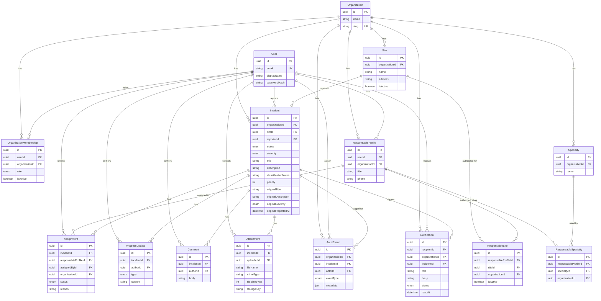

# Database Domain Model

> **GIT-8** - Sprint 0B: Technical Foundation & Quality
>
> This document is the authoritative reference for the platform's
> PostgreSQL domain model. It governs all subsequent data-access
> implementation.

---

## 1. Entity–Relationship Diagram



---

## 2. Entities

### Organization

Tenant root. Every tenant-owned resource resolves to exactly one Organization. MVP starts with one default Organization; the schema supports future multi-organization without changes.

### Site

A physical or logical location within an Organization. Has a unique name within its organization. `isActive` controls whether the site can receive new incidents - inactive sites are retained for historical data but reject new submissions (enforced at service layer).

### User

Global identity/authentication record. Contains only authentication information (email, password hash, display name). Organization-specific roles and profiles are in separate tables. A user is not "in" an organization by virtue of the User record - that relationship is through OrganizationMembership.

### OrganizationMembership

Links a User to an Organization with a specific role. The unique constraint `(userId, organizationId, role)` allows a user to hold both USER and RESPONSABLE roles simultaneously in the same organization as separate membership records. `isActive` supports deactivation without deletion.

### ResponsableProfile

Organization-scoped professional profile. One per (user, organization) pair. Contains operational information (title, phone). Specialties and site access are linked through join tables, not embedded here.

### Specialty

Organization-scoped catalog of specialties. Unique name within an organization.

### ResponsableSpecialty

Join table linking ResponsableProfile to Specialty. Both must belong to the same organization (database-enforced via composite FK).

### ResponsableSite

Explicit site authorization for a responsable. `isActive` supports activation/deactivation without deleting history, so historical assignments remain attributable after profile/site changes (GIT-20). Only active site assignments make a responsable eligible for new incidents at that site.

### Incident

The central domain entity containing both the mutable operational record and the frozen original report snapshot.

**Operational fields** (title, description, severity, status, classificationNotes, priority) evolve through the incident lifecycle.

**Original report fields** (originalTitle, originalDescription, originalSeverity, originalReportedAt) are populated once at creation and never updated. See §5 for the immutability strategy.

### Assignment

First-class domain entity preserving full assignment history. Each assignment is a distinct row. Reassignment creates a new Assignment and marks the old one SUPERSEDED. See §6 for lifecycle details.

### ProgressUpdate

Structured operational progress from the assigned responsable. Has a fixed type set (PROGRESS, BLOCKED, WORK_COMPLETED). Append-only - no `updatedAt`, no edit, no delete in MVP.

### Comment

Free-form communication on incidents. Distinct from structured ProgressUpdates and AuditEvents. Append-only - no `updatedAt`, no edit, no delete in MVP (GIT-37).

### Attachment

Metadata only - binary files reside in external object storage. See §8 for storage strategy.

### AuditEvent

Authoritative, append-only history for meaningful operational events. No `updatedAt`. See §7 for the audit model.

### Notification

Lean in-app notifications for MVP workflow events. Supports UNREAD/READ state and readAt timestamp. Email/push delivery can be added later without changing the domain model.

---

## 3. Cardinality

| Relationship | Cardinality | Notes |
|---|---|---|
| Organization → Site | 1:N | Site cannot exist without an Organization |
| Organization → OrganizationMembership | 1:N | |
| Organization → ResponsableProfile | 1:N | |
| Organization → Specialty | 1:N | |
| Organization → Incident | 1:N | |
| User → OrganizationMembership | 1:N | One membership per (user, org, role) |
| User → ResponsableProfile | 1:N | One profile per (user, org) |
| ResponsableProfile → ResponsableSpecialty | 1:N | M:N with Specialty through join |
| ResponsableProfile → ResponsableSite | 1:N | M:N with Site through join |
| Specialty → ResponsableSpecialty | 1:N | |
| Site → ResponsableSite | 1:N | |
| Site → Incident | 1:N | |
| Incident → Assignment | 1:N | Multiple over time; one active |
| Incident → ProgressUpdate | 1:N | Append-only |
| Incident → Comment | 1:N | Append-only |
| Incident → Attachment | 1:N | |
| Incident → AuditEvent | 1:N | Append-only |
| Incident → Notification | 1:N | |

---

## 4. Tenant Boundaries - Invariant Enforcement

Every tenant-owned resource must resolve to exactly one Organization. Cross-organization references are prevented through a combination of database constraints and service-layer validation.

### Database-enforced (composite foreign keys)

These invariants are structurally impossible to violate at the database level:

| Constraint | Mechanism |
|---|---|
| Incident's site must belong to the same organization as the incident | Composite FK `(siteId, organizationId)` → `Site(id, organizationId)` |
| ResponsableSite's profile must belong to the same org as the site | Composite FK `(responsableProfileId, organizationId)` → `ResponsableProfile(id, organizationId)` and `(siteId, organizationId)` → `Site(id, organizationId)` |
| ResponsableSpecialty's profile and specialty must share the same org | Composite FK `(responsableProfileId, organizationId)` → `ResponsableProfile(id, organizationId)` and `(specialtyId, organizationId)` → `Specialty(id, organizationId)` |
| Assignment's incident must belong to the same org as the assignment | Composite FK `(incidentId, organizationId)` → `Incident(id, organizationId)` |
| Assignment's responsable must belong to the same org as the assignment | Composite FK `(responsableProfileId, organizationId)` → `ResponsableProfile(id, organizationId)` |

These composite FKs require the child tables (ResponsableSite, ResponsableSpecialty, Assignment) to carry their own `organizationId` column. This denormalization is intentional - it is the mechanism that makes the database enforce org consistency.

### Service-layer enforced

These invariants require service-layer code because they involve optional foreign keys or relationships that composite FKs cannot cleanly express in Prisma:

| Invariant | Reason |
|---|---|
| AuditEvent: when incidentId is set, the incident must belong to the same org | incidentId is optional; Prisma requires all composite FK fields to share optionality for optional relations |
| Notification: when incidentId is set, the incident must belong to the same org | Same as AuditEvent |
| Assignment: only one PENDING or ACCEPTED assignment per incident at a time | Conditional/partial unique index not expressible in Prisma; enforce transactionally |
| Assignment: the responsable must have an active ResponsableSite for the incident's site | Business rule beyond FK scope |
| Inactive Site rejects new incidents | Business rule; isActive is a soft flag |
| Original report immutability | See §5 |
| AuditEvent append-only | See §7 |

### Intentionally deferred

| Invariant | Reason |
|---|---|
| Database trigger for original report immutability | Service-layer enforcement is sufficient for MVP; trigger can be added if audit requirements escalate |
| Row-level security (RLS) for multi-tenancy | Not required for single-process modular monolith MVP |
| Partial unique index for single-active-assignment | Can be added via raw SQL migration if service-layer enforcement proves insufficient |

---

## 5. Original Report Immutability

The architecture document (§5.1) requires the original incident submission to remain distinguishable from later operational information. The model implements this through frozen columns on the Incident table.

### Design

The Incident table contains two conceptual records:

1. **Original report** - `originalTitle`, `originalDescription`, `originalSeverity`, `originalReportedAt`
2. **Operational record** - `title`, `description`, `severity`, `status`, `classificationNotes`, `priority`, `updatedAt`

### Rules

- The `original*` fields are populated exactly once, at incident creation time
- At creation, `originalTitle = title`, `originalDescription = description`, `originalSeverity = severity`, `originalReportedAt = createdAt`
- After creation, the operational fields (`title`, `description`, `severity`, etc.) may evolve through triage and lifecycle transitions
- The `original*` fields are never included in any Prisma `update()` call
- This is a **service-layer invariant** - application code is responsible for never updating these fields
- A database trigger that rejects UPDATE on these columns is intentionally deferred; it can be added via a raw SQL migration if the risk profile changes
- This is **not** database-enforced immutability - it is application-enforced, and the documentation does not claim otherwise

### Why frozen columns instead of a separate table

A separate `OriginalReport` table would create a 1:1 relationship requiring a join on every incident query. The frozen-column approach co-locates the data, avoids the join overhead, and is equally auditable through the AuditEvent trail. The tradeoff is that the database itself does not prevent updates to these columns.

---

## 6. Assignment Model

Assignment is a first-class domain entity, not a field on Incident. This preserves complete assignment history.

### Lifecycle

```
PENDING ──→ ACCEPTED                    (responsable accepts)
PENDING ──→ REASSIGNMENT_REQUESTED      (responsable declines)
PENDING ──→ SUPERSEDED                  (admin creates new assignment)
ACCEPTED ──→ SUPERSEDED                 (admin reassigns)
REASSIGNMENT_REQUESTED ──→ SUPERSEDED   (admin reassigns after decline)
```

### Semantics

- An administrator creates an Assignment with status PENDING
- The assigned responsable may ACCEPT or request REASSIGNMENT
- Acceptance/rejection do **not** create additional Incident states - they are Assignment-level events
- When a new assignment is created (reassignment), the previous Assignment is marked SUPERSEDED
- Only one Assignment should be in PENDING or ACCEPTED status for a given incident at any time
- This single-active-assignment invariant is enforced **transactionally at the service layer**: when creating a new assignment, the service marks any existing PENDING/ACCEPTED assignment as SUPERSEDED within the same transaction
- Historical assignments remain queryable - they are never deleted
- Prisma cannot express a conditional partial unique index (`WHERE status IN ('PENDING', 'ACCEPTED')`), so a database constraint is not used here

### Tenant integrity

Assignment carries its own `organizationId` column with composite FKs to both `Incident(id, organizationId)` and `ResponsableProfile(id, organizationId)`. The database structurally prevents an assignment from crossing organization boundaries.

The service layer additionally verifies that the responsable has an active `ResponsableSite` for the incident's site before creating an assignment.

---

## 7. Audit Model

AuditEvent stores authoritative history for meaningful operational events.

### Event types (MVP)

| Type | Trigger |
|---|---|
| `INCIDENT_CREATED` | Incident submitted and verified |
| `STATUS_CHANGE` | Any lifecycle state transition |
| `CLASSIFICATION_CHANGE` | Administrator triages classification/priority |
| `ASSIGNMENT_CREATED` | Administrator assigns a responsable |
| `ASSIGNMENT_ACCEPTED` | Responsable accepts assignment |
| `REASSIGNMENT_REQUESTED` | Responsable requests reassignment |
| `RESOLUTION_SUBMITTED` | Responsable marks work complete |
| `INCIDENT_CLOSED` | Administrator confirms closure |

### Structure

Each AuditEvent records:
- `actorId` - the user who performed the action
- `eventType` - what happened
- `metadata` (JSON) - before/after values where applicable
- `createdAt` - when it happened
- `organizationId` - tenant scope
- `incidentId` - the affected incident (optional for org-level events)

### Append-only semantics

AuditEvent has no `updatedAt` field. The service layer must never call `update()` or `delete()` on AuditEvent records. This is an application invariant, not a database constraint. The table does not have UPDATE or DELETE triggers in MVP.

New event types can be added to the `AuditEventType` enum as later sprints ship (GIT-18, GIT-19, GIT-26). The model is designed so that later sprints add data without requiring schema changes beyond enum additions.

---

## 8. Attachment Storage Strategy

Binary files are stored in external object storage (S3-compatible bucket), not in PostgreSQL. The Attachment table stores metadata only:

| Field | Purpose |
|---|---|
| `fileName` | Original filename as submitted |
| `mimeType` | Content type for correct serving |
| `fileSizeBytes` | File size for UI display and validation |
| `storageKey` | Reference to the object in the storage bucket |

Presigned URLs are the preferred upload mechanism (to be detailed in the attachments sprint). The database record and the storage object must be kept consistent - orphaned objects are a defect.

The `storageKey` is opaque from the database's perspective. Its format (e.g., `{orgId}/{incidentId}/{uuid}.{ext}`) is determined by the attachments implementation, not by the schema.

---

## 9. Indexes

Indexes are chosen for documented query patterns, not applied to every column.

| Table | Index | Query Pattern |
|---|---|---|
| Incident | `(organizationId, status)` | Admin dashboard: incidents by org filtered by status |
| Incident | `(organizationId, siteId)` | Site-scoped incident listing |
| Incident | `(reporterId)` | "My reported incidents" for Users |
| Assignment | `(incidentId)` | Assignment history for an incident |
| Assignment | `(responsableProfileId, status)` | "My active assignments" for Responsables |
| OrganizationMembership | `(userId)` | User's memberships lookup at login |
| OrganizationMembership | `(organizationId, role)` | List members by role within an org |
| ResponsableSite | `(siteId, isActive)` | Eligible responsables for a site during assignment |
| AuditEvent | `(incidentId)` | Incident audit timeline |
| AuditEvent | `(organizationId, createdAt)` | Org-wide audit log (chronological) |
| Notification | `(recipientId, status)` | Unread notifications for a user |
| ProgressUpdate | `(incidentId)` | Progress timeline for an incident |
| Comment | `(incidentId)` | Comments for an incident |
| Attachment | `(incidentId)` | Attachments for an incident |

Unique constraints (which implicitly create indexes) also serve query patterns:

| Table | Unique Constraint | Purpose |
|---|---|---|
| Organization | `slug` | Lookup by slug |
| User | `email` | Login/registration lookup |
| Site | `(organizationId, name)` | Prevent duplicate site names |
| OrganizationMembership | `(userId, organizationId, role)` | Prevent duplicate role grants |
| ResponsableProfile | `(userId, organizationId)` | One profile per user per org |
| Specialty | `(organizationId, name)` | Prevent duplicate specialty names |
| ResponsableSpecialty | `(responsableProfileId, specialtyId)` | Prevent duplicate assignments |
| ResponsableSite | `(responsableProfileId, siteId)` | Prevent duplicate site grants |

---

## 10. Enums

| Enum | Values | Used By |
|---|---|---|
| `OrgRole` | USER, RESPONSABLE, ADMINISTRATOR | OrganizationMembership.role |
| `IncidentStatus` | NEW, ASSIGNED, IN_PROGRESS, RESOLVED, CLOSED | Incident.status |
| `IncidentSeverity` | LOW, MEDIUM, HIGH, CRITICAL | Incident.severity, Incident.originalSeverity |
| `AssignmentStatus` | PENDING, ACCEPTED, REASSIGNMENT_REQUESTED, SUPERSEDED | Assignment.status |
| `ProgressUpdateType` | PROGRESS, BLOCKED, WORK_COMPLETED | ProgressUpdate.type |
| `AuditEventType` | INCIDENT_CREATED, STATUS_CHANGE, CLASSIFICATION_CHANGE, ASSIGNMENT_CREATED, ASSIGNMENT_ACCEPTED, REASSIGNMENT_REQUESTED, RESOLUTION_SUBMITTED, INCIDENT_CLOSED | AuditEvent.eventType |
| `NotificationStatus` | UNREAD, READ | Notification.status |

---

## 11. Migration Strategy

### Current state

Prisma is initialized in `packages/backend/prisma/schema.prisma` with the full domain model. The schema is validated and formatted. No migration has been created because no PostgreSQL instance is available in the current development environment.

### Creating the initial migration

When a developer first sets up a local PostgreSQL database:

```bash
# 1. Start PostgreSQL (e.g., via Docker)
docker run -d --name incident-db -p 5432:5432 \
  -e POSTGRES_USER=user \
  -e POSTGRES_PASSWORD=password \
  -e POSTGRES_DB=incident_db \
  postgres:16

# 2. Copy .env.example to .env and verify DATABASE_URL
cp .env.example .env

# 3. Create the initial migration from packages/backend/
cd packages/backend
pnpm prisma:migrate:dev -- --name init

# This creates:
#   prisma/migrations/<timestamp>_init/migration.sql
#   prisma/migrations/migration_lock.toml
```

The generated migration SQL is committed to the repository. Once committed, all developers can apply it:

```bash
pnpm prisma:migrate:dev
```

### Migration workflow for subsequent changes

1. Modify `prisma/schema.prisma`
2. Run `pnpm prisma:validate` to verify correctness
3. Run `pnpm prisma:format` to normalize formatting
4. Run `pnpm prisma:migrate:dev -- --name <description>` to generate a migration
5. Review the generated SQL in `prisma/migrations/<timestamp>_<description>/migration.sql`
6. Commit the schema change and migration together

### Deployment

In production/staging, `prisma migrate deploy` applies pending migrations without interactive prompts:

```bash
pnpm prisma:migrate:deploy
```

This should run as part of the deployment pipeline before the application starts.

### Why no initial migration is committed

An initial migration requires a running PostgreSQL instance. `prisma migrate dev` connects to the database, applies the migration, and records it in the `_prisma_migrations` table. Without a database, the migration cannot be created or tested. The schema itself is validated (syntax, relationships, types) without a database via `prisma validate`, but the actual DDL generation and application require a live connection.

The first developer to set up a local database will generate and commit the initial migration. This is documented here rather than shipping a fake migration that was never actually applied.

---

## 12. Compatibility Notes

### GIT-13 - User self-registration

The User model stores global identity (email, passwordHash, displayName). OrganizationMembership links users to organizations with roles. This separation cleanly supports the registration → organization-association flow.

### GIT-19 - Assignment acceptance & intervention

The Assignment model supports PENDING → ACCEPTED and PENDING → REASSIGNMENT_REQUESTED transitions without adding Incident states. The service layer moves the Incident to IN_PROGRESS when a responsable accepts.

### GIT-20 - Responsable specialties & Site access

ResponsableSpecialty and ResponsableSite are dedicated join tables with `isActive` flags for deactivation without history loss. Composite FKs enforce org consistency.

### GIT-22 - Incident history and audit trail

AuditEvent covers all MVP event types. The `metadata` JSON field stores before/after values. The model is append-only by convention.

### GIT-24 - Structured progress updates

ProgressUpdate has a fixed type enum (PROGRESS, BLOCKED, WORK_COMPLETED) and is append-only. It is distinct from Comment and AuditEvent.

### GIT-37 - Incident comments

Comment is a separate table from ProgressUpdate. Append-only in MVP.

### GIT-27 - Core workflow notifications

Notification supports in-app UNREAD/READ state. The model does not prescribe a delivery mechanism - email/push can be added without schema changes.

### Architecture decisions

- Modular monolith, no microservices
- PostgreSQL via Prisma ORM
- Organization scoping from verified session
- No Redis, no message queues, no event bus
- Attachment metadata only, binary in object storage
